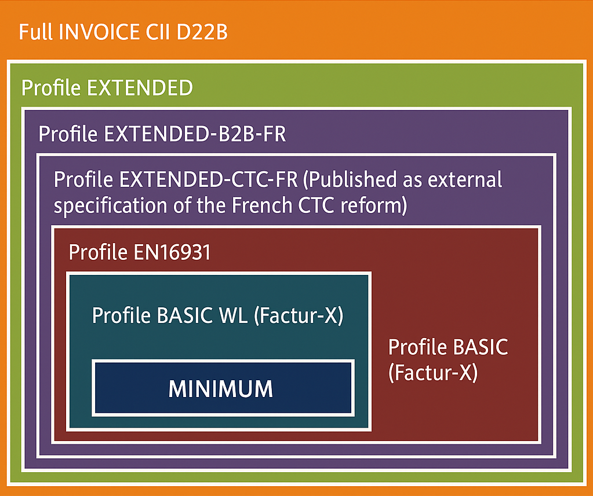

# E-Invoice Validator

We have carefully collected all relevant information and compiled a preconfigured e-invoice validator designed for 
use in Germany. This tool is provided as-is, without any guarantees or warranties. Users are strongly advised to 
verify the accuracy and compliance independently through official sources.

## Factur-X 1.07.2 (ZUGFeRD 2.3.2)

**Factur-X** is a hybrid electronic invoice format developed by a French-German consortium, combining human-readable
PDF/A-3 documents with embedded XML data. It complies with the European Norm EN 16931, facilitating automated processing
and easy accessibility for small to medium-sized enterprises (SMEs).

### Key Features:
- **Hybrid Format**: PDF with embedded XML (UN/CEFACT CII D22B XML standard)
- Human and machine-readable
- Compliant with EU Directive 2014/55/EU
- Designed for easy adoption by SMEs

### Profiles Supported:

- **MINIMUM**: Basic information only (not valid as a full invoice under certain legal contexts)
- **BASIC WL**: Header and footer information without line items
- **BASIC**: Full compliance with EN 16931 requirements, including line items
- **EN 16931**: Complete European semantic standard
- **EXTENDED**: Additional fields for complex business cases, including French CTC compliance
- **XRECHNUNG**: Reference profile compatible with the German XRechnung standard

### Further information

For detailed specifications, validation tools, and additional resources, refer to the comprehensive documentation 
provided by FNFE-MPE (French team) and [FeRD](https://www.ferd-net.de/) (German team).

## XRechnung

**XRechnung** is an XML-based semantic data model established as the standard for electronic invoices in Germany, particularly for transactions with public sector entities.

### Key Features

- **Compliance**: Aligns with the European Norm EN 16931, ensuring interoperability across EU member states.
- **Standardization**: Serves as Germany's Core Invoice Usage Specification (CIUS), detailing national requirements for electronic invoicing.
- **Machine-Readable**: Facilitates automated processing by representing invoice data in a structured XML format.

### Implementation in Germany

- **Legal Mandate**: Suppliers to federal public authorities are required to submit invoices electronically using the XRechnung standard.
- **Transmission Portals**: Invoices are submitted through centralized platforms like the Zentrale Rechnungseingangsplattform des Bundes (ZRE) and the OZG-konforme Rechnungseingangsplattform (OZG-RE).

### Technical Specifications

- **Data Format**: Utilizes XML to encode invoice information, ensuring both human readability and machine processability.
- **Profiles**: Supports various profiles, including 'Minimum', 'Basic WL', 'Basic', 'EN 16931', 'Extended', and 'XRechnung', 
each catering to different levels of invoice complexity and compliance requirements. 

### Integration with Other Standards

- **ZUGFeRD Compatibility**: Since ZUGFeRD profile version 2.2.0 'XRECHNUNG' can be combined into human-readable
  PDF/A-3 documents.

### Further information

- The [Coordination Office for IT Standards (KoSIT)](https://www.xoev.de/) provides the XRechnung specification and related resources.
- For comprehensive information and updates, visit the official [E-Rechnung-Bund website](https://www.e-rechnung-bund.de).
