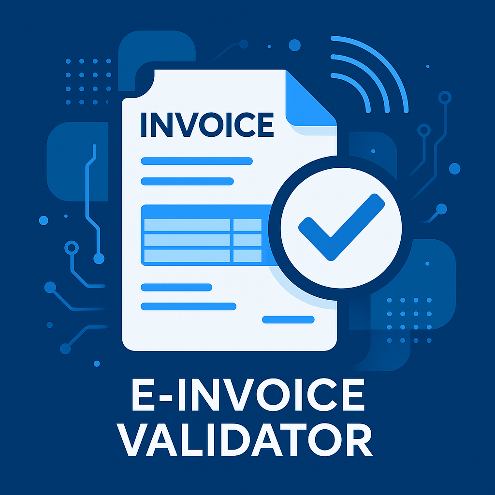

# E-Invoice Validator for Germany

<p align="center">
  
</p>

> [!IMPORTANT]
> This tool and the information provided are offered as-is, without any guarantees or warranties. While we strive for accuracy,
>  we highly recommend verifying compliance and correctness using official documentation and sources.

With the Wachstumschancengesetz (2024), Germany introduced mandatory electronic invoicing for B2B transactions using 
a phased approach:

Effective from **2025-01-01**:
* Paper invoices no longer take precedence.
* All businesses may send electronic invoices (in a legally compliant format).
* All businesses must be able to receive electronic invoices.
* Other formats (e.g., PDF) may be used if both parties agree.

From **2027-01-01**:
* Businesses with annual turnover > €800,000 must send electronic invoices.
* Businesses with turnover ≤ €800,000 may continue using other invoice formats.

From **2028-01-01**
* All businesses must send electronic invoices.
* Existing systems must comply with legal requirements.

As a business receiving e-invoices, you are required to validate that each invoice complies with the European standard EN 16931.

This project helps you do exactly that.

We’ve bundled everything you need into a preconfigured, easy-to-use validation service, delivered as a Docker container, specifically tailored for use in Germany.

Under the hood, it uses the official [KoSIT validator](https://github.com/itplr-kosit/validator)  and includes multiple configurations to support all relevant invoicing scenarios.

## Usage

```bash
docker run -p8080:80 backofficeplus/e-invoice-validator:latest
```

### Access the HTTP interface

The validation service listens to `POST`-requests on any server URL. You need to supply the xml/object to validate in the HTTP body.
The last segment of the request URI is treated as the name of the input. E.g. requests to `/myfile.xml`, `/mypath/myfile.xml` and `/mypath/myfile.xml?someParam=1`
would all result in an input named `myfile.xml`. If you don't specify a specific request URI (e.g. POST to `/`), the name is auto generated for you.

The service expects a single XML input in the HTTP body, e.g. `multipart/form-data` is NOT supported.

**Note**: The API does not accept PDF files.  If your e-invoice is embedded within a PDF (e.g., as a ZUGFeRD/Factur-X 
or XRechnung attachment), you must extract the XML file before submitting it for validation.

Examples:

#### cURL

```shell script
curl --location --request POST 'http://localhost:8080' \
--header 'Content-Type: application/xml' \
--data-binary '@/target.xml'
```

#### Java (Apache HttpClient)

```java
HttpClient httpClient = HttpClientBuilder.create().build();
HttpPost postRequest = new HttpPost("http://localhost:8080/");
FileEntity entity = new FileEntity(Paths.get("some.xml").toFile(), ContentType.APPLICATION_XML);
postRequest.setEntity(entity);
HttpResponse response = httpClient.execute(postRequest);
System.out.println(IOUtils.toString(response.getEntity().getContent()));
```

#### JavaScript

```javascript
var myHeaders = new Headers();
myHeaders.append("Content-Type", "application/xml");

var file = "<file contents here>";

var requestOptions = {
  method: 'POST',
  headers: myHeaders,
  body: file,
  redirect: 'follow'
};

fetch("http://localhost:8080", requestOptions)
  .then(response => response.text())
  .then(result => console.log(result))
  .catch(error => console.log('error', error));
```

#### PHP (Symfony HttpClient)

```php
$httpClient = HttpClient::create();

$response = $httpClient->request('POST', 'http://localhost:8080', [
  'headers' => [
    'Content-Type' => 'application/xml',
  ],
  'body' => fopen('/path/to/some.xml', 'r'),
]);

echo $response->getContent();

```

#### Status codes
| code | description |
|-|-|
| 200  | The xml file is acceptable according to the scenario configurations |
| 400 | Bad request. the request contains errors, e.g. no content supplied  |
| 405 | Method not allowed. Thec check service is only answering on POST requests |
| 406 | The xml file is NOT acceptable according to the scenario configurations| 
| 422 | Unprocessable entity. Indicates an error while processing the xml file. This hints to errors in the scenario configuration |
| 500 | Internal server error. Something went wrong |

#### Authorization

There is no mechanism to check, whether client is allowed to consume the service or not. The user is responsible to secure access to the service.
This can be done using infrastructural service like a forwarding proxies (e.g. `nginx` or `Apache http server`) or by implementing a custom solution.

#### Monitoring and administration

The validation service can be integrated in monitoring solutions like `Icinga` or `Nagios`. There is a `health` endpoint exposed under `/server/health` wich returns some basic information about the service like memory consumption, general information about the version and a status `UP` as an XML file.

## Validator Test Suite

This directory includes a bash test script to validate multiple XML files against the validator API.

The current files are a set composed of [official XRechnung test corpus from KoSIT](https://github.com/itplr-kosit/xrechnung-testsuite/releases?page=1)
and example files from [FeRD](https://www.ferd-net.de/)

- The script assumes the validator API is available at `http://localhost:8080/`
- Valid XML files are placed in `test-data/valid-files/`
- Invalid XML files are placed in `test-data/invalid-files/`

### Running Tests

Run the test script:

```bash
./validation-api.spec.sh
```

For verbose output, use:
```bash
./validation-api.spec.sh -v
```

The script will:
1. Find all XML files in the test directories
2. Send each file to the validator API
3. Check if the validation results match expectations
4. Display a summary of test results

### Test Script Behavior

The script validates files with the following criteria:
- Valid files should return status code 200 and contain an acceptance recommendation
- Invalid files should return status code 406

### Exit Codes

- `0`: All tests passed successfully
- `1`: Some tests failed (validation results didn't match expectations)

## Preconfigured scenarios and profiles for use in Germany

### XRechnung 2.0

* XRechnung 2.0.1 - EN16931 XRechnung (UBL Invoice)
* XRechnung 2.0.1 - EN16931 XRechnung Extension (UBL Invoice)
* XRechnung 2.0.1 - EN16931 XRechnung (UBL CreditNote)
* XRechnung 2.0.1 - EN16931 XRechnung (CII)

### XRechnung 2.1

* XRechnung 2.1.1 - EN16931 XRechnung (UBL Invoice)
* XRechnung 2.1.1 - EN16931 XRechnung Extension (UBL Invoice)
* XRechnung 2.1.1 - EN16931 XRechnung (UBL CreditNote)
* XRechnung 2.1.1 - EN16931 XRechnung (CII)

### XRechnung 2.2

* XRechnung 2.2.0 - EN16931 XRechnung (UBL Invoice)
* XRechnung 2.2.0 - EN16931 XRechnung Extension (UBL Invoice)
* XRechnung 2.2.0 - EN16931 XRechnung (UBL CreditNote)
* XRechnung 2.2.0 - EN16931 XRechnung (CII)
* XRechnung 2.2.0 - EN16931 XRechnung Extension (CII)

### XRechnung 2.3

* XRechnung 2.3.1 - EN16931 XRechnung (UBL Invoice)
* XRechnung 2.3.1 - EN16931 XRechnung Extension (UBL Invoice)
* XRechnung 2.3.1 - EN16931 XRechnung (UBL CreditNote)
* XRechnung 2.3.1 - EN16931 XRechnung (CII)
* XRechnung 2.3.1 - EN16931 XRechnung Extension (CII)

### XRechnung 3.0

* XRechnung 3.0.2 - EN16931 XRechnung (UBL Invoice)
* XRechnung 3.0.2 - EN16931 XRechnung Extension (UBL Invoice)
* XRechnung 3.0.2 - EN16931 XRechnung (UBL CreditNote)
* XRechnung 3.0.2 - EN16931 XRechnung (CII)
* XRechnung 3.0.2 - EN16931 XRechnung Extension (CII)

### ZUGFeRD 2.3 / Factur-X 1.07

* ZUGFeRD 2.3.2/Factur-X 1.07.2 - EN16931 (CII) Extended
* ZUGFeRD 2.3.2/Factur-X 1.07.2 - Basic
* ZUGFeRD 2.3.2/Factur-X 1.07.2 - Comfort (EN16931)

## Detailed information about supported standards

### Factur-X (ZUGFeRD)

**Factur-X** is a hybrid electronic invoice format developed by a French-German consortium, combining human-readable
PDF/A-3 documents with an embedded XML file. It complies with the European Norm EN 16931, facilitating automated processing
and easy accessibility for small to medium-sized enterprises (SMEs).

The hybrid format originally introduced in Germany as “ZUGFeRD” is technically identical to “Factur-X” — both terms 
refer to the same data structure. To emphasize its international character, this project consistently uses the term
“Factur-X”, even when referring to what was formerly known as ZUGFeRD.

#### Key Features:
- **Hybrid Format**: PDF with embedded XML
- Human and machine-readable
- Full compliance with EN 16931 requirements (exceptions: Profiles "Minimum" and "Basic WL" are not compliant)
- Designed for easy adoption by SMEs

#### Profiles Supported:


- **MINIMUM**: Basic information only (not valid as a full invoice)
- **BASIC WL**: Header and footer information without line items (not valid as a full invoice)
- **BASIC**: Full compliance with EN 16931 requirements, including line items
- **EN 16931**: Complete European semantic standard
- **EXTENDED**: Additional fields for complex business cases, including French CTC compliance
- **XRECHNUNG**: Reference profile compatible with the German XRechnung standard

#### Further information

For detailed specifications and additional resources refer to the comprehensive documentation 
provided by FNFE-MPE (French team) and [FeRD](https://www.ferd-net.de/) (German team).

### XRechnung

XRechnung is an XML-based e-invoicing format that serves as the official standard for electronic invoices in Germany, 
particularly in transactions with public sector entities. It is fully compliant with the European Norm EN 16931, 
ensuring semantic consistency and interoperability across EU member states.

It supports two different syntaxes: UBL (Universal Business Language) and CII (Cross Industry Invoice) which represent the same semantic model.

#### Key Features

- **Standards-Compliant**: Conforms to EN 16931 and the German CIUS (Core Invoice Usage Specification).
- **Dual Syntax Support**: Available in two XML syntaxes:
  - UBL (Universal Business Language)
  - CII (Cross Industry Invoice)
- **Machine-Readable**: Optimized for automated processing with structured XML data.

#### Use in B2G (Business-to-Government)

- **Legal Requirement**: Electronic invoicing using XRechnung is mandatory for suppliers to federal public authorities.
- **Submission Portals**
  - Zentrale Rechnungseingangsplattform des Bundes
  - OZG-RE – OZG-konforme Rechnungseingangsplattform der Länder und Kommunen

#### Use in B2B (Business-to-Business)

While XRechnung is primarily intended for B2G (Business-to-Government), the underlying EN 16931 standard is equally
applicable to B2B transactions. The format can be adopted voluntarily in B2B contexts where:

- Interoperability with EU partners is desired
- Automation and machine-readability of invoice data are important
- Compliance with PEPPOL or other cross-border standards is required

Many companies in regulated sectors (e.g., utilities, healthcare) are already adopting EN 16931-compliant invoices for B2B workflows.

#### ZUGFeRD Compatibility

Since version 2.2.0, the ZUGFeRD profile “XRECHNUNG” enables combining XRechnung-compliant XML with a human-readable 
PDF/A-3 container (Factur-X style). This hybrid approach is useful for B2B scenarios where a visual invoice is still expected.

#### Versions Suported

The validator supports the following validation sets from the [KoSIT XRechnung Configurations](https://github.com/itplr-kosit/validator-configuration-xrechnung) repository:

- 2.0.1 (2020-12-31)
- 2.1.1 (2021-11-15)
- 2.2.0 (2022-11-15)
- 2.3.1 (2023-05-12)
- 3.0.2 (2024-10-31)

#### Further information

- KoSIT – Official specification & tools: [xoev.de](https://www.xoev.de/) [KoSIT Github Organization](https://github.com/itplr-kosit)
- [XStandards Einkauf](https://xeinkauf.de/xrechnung/)
- E-Rechnung Bund – Government e-invoicing portal: [e-rechnung-bund.de](https://www.e-rechnung-bund.de)

### Creating new scenario configurations

Here’s a concise step-by-step guide to creating a new scenario for the KoSIT Validator by following the structure of the XRechnung profile:

1. Understand the Scenario
   The scenarios.xml defines:

Namespaces for key elements.
Match Rules to identify documents by CustomizationID.
Validation Steps for XML Schema and Schematron.
Reporting Rules for validation output.

2. Gather Resources
   Collect the scenario-specific resources:

XSD files for the profile (e.g., EN16931 and ZUGFeRD-specific schemas).
Schematron (XSLT) for additional business rules.
Documentation on CustomizationID values.

3. Define Namespaces
   In the scenario, declare namespaces relevant to you scenarion, such as: `rsm: Cross-Industry Invoice (CII) namespace.`

Any additional namespaces needed for validation.

4. Match Documents Using CustomizationID
   Use the match element to identify documents based on their CustomizationID.

Example: `<match>exists(/rsm:CrossIndustryInvoice/rsm:ExchangedDocumentContext/rsm:GuidelineSpecifiedDocumentContextParameter/rsm:ID[ . = 'urn:factur-x.eu:1p0:extended'])</match>`

Replace `urn:factur-x.eu:1p0:extended` with the CustomizationID for the desired profile.

5. Add XML Schema Validation
   Include `<validateWithXmlSchema>` to ensure the document conforms to the structure defined in the XSDs:

Example:

```xml
<validateWithXmlSchema>
  <resource>
    <name>XML Schema for my Scenario</name>
    <location>path/to/my-schema.xsd</location>
  </resource>
</validateWithXmlSchema>
```

6. Add Schematron Validation
   Reference Schematron rules for additional validations:

```xml
<validateWithSchematron>
  <resource>
    <name>My Scenario Schema</name>
    <location>path/to/my-rules.xsl</location>
  </resource>
</validateWithSchematron>
```

7. Configure Reporting
   Define how validation results are reported:

```xml
<createReport>
  <resource>
    <name>Validation Report</name>
    <location>path/to/report-template.xsl</location>
  </resource>
</createReport>
```

------------------------------------------------------------

That's it. Have a happy e-invoice validation experience and focus on what really matters: solving the core problems
of your customers.

Brought to you by:

<a href="https://backoffice.plus/">
  
</a>

[backoffice.plus](https://backoffice.plus/) 🚀 Digital Transformation & Automation

Contributors:

- Karl Adler
- Julian Haupt
- David Wolter

------------------------------------------------------------
